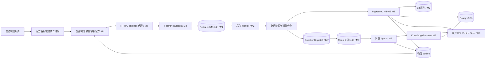

# 微信个人知识库 AI 助手：系统架构

## 1. 范围与总体设计

采用 Python 3.12 模块化单体，共享领域模型，独立部署 API、微信同步/回复 worker、ingestion worker、问答 worker 和无外部网络的浏览器服务。M9 增加可选 HTTPS 代理及私有接入/运维命令。**M1—M9 已通过本地工程验收，复现方法和验证边界见[测试说明](docs/testing.md)。官方 HTTP 测试使用合成响应，不表示已完成真实企业公网联调或真实模型效果验收。**

用户入口是专用微信客服账号的官方链接或二维码，普通微信用户打开会话后发资料、提问并接收回复；无需个人号登录或先开发小程序。真实账号权限、名单、服务器、域名证书和云服务由部署方配置，当前未上线。首次接入步骤见 [微信开通与扫码使用](docs/wechat-launch.md)。

下文保留各 milestone 的阶段边界；早期阶段的降级行为用于说明关闭后续功能开关时的表现。完整助手须按部署说明统一开启收录、解析、索引和问答。

## 2. 模块边界

| 模块 | 所属职责 | 当前范围 |
| --- | --- | --- |
| `app/main.py`, `app/api/` | 应用装配、健康探针和 HTTP 传输边界 | M1 起 |
| `app/core/` | 环境配置、结构化日志白名单与字段校验、应用资源生命周期 | M1/M9 |
| `app/domain/` | CanonicalDocument、来源/状态枚举 | M1 数据契约 |
| `app/db/`, `migrations/` | SQLAlchemy 模型、租户事务、Alembic、约束/RLS | M1 |
| `app/connectors/wecom/` | callback、crypto、官方 API/token/media/setup adapter、归一化、队列、游标、outbox、同步、业务桥接、发送前权限检查和首次接入 CLI | M2/M3/M7/M8/M9 |
| `app/ingestion/` | 来源检测、任务仓储、租约、统一流水线、Markdown、可靠分发/消费、原位补正文/媒体资产、索引/删除任务调度、原卡片视频补充 | M3—M6/M8 |
| `app/parsers/` | 文档/OCR/网页解析和音视频编排；解析 adapter 执行受限子进程；视频号只解析卡片字段 | M4/M5/M8 |
| `app/knowledge/` | KnowledgeService 和引用解析 | M6 |
| `app/agent/` | 独立问答任务/调度/确认账本、Responses 循环、受控工具、证据锁与摘录渲染 | M7 |
| `app/adapters/` | S3/OpenAI/安全 HTTP 等接口实现（微信单独归 connector） | M3 起 |
| `app/workers/` | 资源装配、受限角色检查、心跳、终止信号、运维重试入口 | M2；具体微信逻辑在 connector |
| `app/operations/` | 离线角色预检、企业范围内的只读运维状态；无公网管理接口 | M9 |
| `scripts/deployment_check.py`, `compose.production.yml`, `infrastructure/nginx/` | 完整部署配置检查、受限 HTTPS callback 入口、日志和停止宽限期 | M9 |

业务服务依赖自定义 Protocol / DTO；第三方响应由 adapter 归一化后返回。M1 不导入 OpenAI SDK，不添加返回虚假成功的占位接口。对 PostgreSQL/Redis 的基础健康检查属于基础设施层。

## 3. 微信客服入口与可靠异步处理（M2）

仅使用企业微信“微信客服”官方 API，不使用个人微信 Hook、非官方协议或机器人库。

1. callback GET 验签、AES 解密并在官方 1 秒要求内返回验证内容；POST 对加密事件验签、解密、校验企业身份，拒绝超限请求，响应不得超过官方 5 秒窗口。
2. callback 事件是读取消息的通知。处理器将通知写入 Redis Stream 后快速确认；不能在 callback 下载文件、转录、调用模型或同步读取全部消息。Redis 不可用或落盘未确认返回 503，不能吞事件返回成功。官方明确的重试针对网络失败/超时，不假设任意 503 都一定重试，因此补拉必不可少。
3. Worker 以客服账号为粒度串行读取 `sync_msg`，使用持久化 cursor 循环分页；cursor 只在本页消息已持久化后推进，msg_list 为空但 has_more=1 仍继续。通知 Token 有效 10 分钟，读取仅覆盖最近 3 天，因此需定期对账补拉及积压告警；只将 origin=3 的客户消息送入资料/问答路由。
4. 用验证后的企业身份 + external_userid 映射内部 UUID；空 allowlist 拒绝所有人。对非允许用户不下载、不调用模型、不建立知识库。
5. 以租户与官方 msgid 做数据库唯一约束；Redis 去重仅作优化，不能替代持久去重。消息任务采用至少一次投递，业务幂等实现一次效果。
6. access_token 缓存提前过期、分布式刷新锁、失效重取；API 调用有超时、退避和错误分类。代码全部在 `app/connectors/wecom/`。
7. 收录任务先发“收到，正在整理：XXX”，完成且索引可用后发“已收录：XXX”；metadata_only 明确说明仅保存卡片信息。官方回复受接待状态、用户消息后 48 小时及最多 5 条消息约束；文本上限为 2048 字节。两次收录通知消耗配额，超出时记录待投递/失败，不无限重试。send_msg 成功后仍需处理后续发送失败事件。

M2 新增 `wecom_sync_states` 和 `wecom_outbox`，不把通道状态混进 sources。每页同步持有客服游标行锁；每个租户事务原子保存 message + 回复 outbox，全部成功才推进游标。一页中途失败可留下已提交消息，重拉通过唯一约束避免重复回复。同步失败持久化错误与退避后才能 ACK 通知；数据库失败则保留 Redis pending。每 60 秒补拉配置账号，60 秒 pending reclaim 恢复被中断的消费。达到页数预算留存游标，下个轮次继续。

Redis 7.4 使用 AOF everysec；Lua 原子 XADD/去重之后，在同连接执行 `WAITAOF 1 0 1500`。重复分支也写入去重键（保留 TTL），使落盘确认覆盖当前连接的写入屏障；通知缓存 10 分钟，消息去重长期依赖数据库。默认 POST 总预算 3 秒、请求体 64 KiB；GET 无网络 I/O。队列超 100000 条拒绝新入队，不裁剪未消费任务。Malformed 内部队列记录保留待运维检查；不假装存在完整死信管理台。

`pkb_app` 只按租户存消息和插入 outbox；`pkb_connector` 只能读写当前企业的同步状态、读取/更新 outbox，不能读取用户知识或消息表。两者均非 owner、非 BYPASSRLS。用户身份 UUID 来自已验证企业和 allowlist 允许的 external_userid；冲突拒绝，不覆盖已有身份。

outbox 的 `sent` 仅表示官方 API 接受，后续 `msg_send_fail` 可将其改为 failed。每条回复持久固定 msgid；95033 只表示 ID 重复，不能作为送达证明。超时/模糊 HTTP 响应保留 uncertain，停止自动发送；人工重试仍使用原 ID。已知窗口/配额/会话状态错误 deferred；瞬时错误有限指数退避。官方接待状态由发送接口裁决，本地预检查 48 小时/5 条不能代替服务端判断。M2 只发“收到，微信客服连接已就绪。资料整理和知识库问答功能尚未启用。”；第 7 点的收录通知属于后续收录流程。

M3 启用时，微信同步通过 admission 接口在同一租户事务中创建 sources、ingestion_jobs、message_sources 与 ingestion_dispatches；未启用时保持 M2 行为。token 凭据按企业 + secret 摘要隔离；40014/42001 最多刷新一次，95007 最多去掉通知 token 再拉一次且保留 cursor。未知错误不擅自清空游标。

M9 的私有 `setup` CLI 通过独立 `SetupAPIProtocol` 复用官方 HTTP/token adapter，调用账号列表和客服链接接口；官方链接原样保存，不用账号 ID 拼接 URL。首次识别在单个已配置且有 API 管理权限的账号中匹配10分钟内的随机挑战文本，要求唯一客户身份。结果只写管理员私有新文件，不修改业务游标、allowlist 或知识库；管理员核对后再配置名单。空名单引导期间运行中的 worker 仍拒绝用户资料。精确匹配“微信验证 + 32位小写十六进制”的控制消息始终跳过，不持久化、不调用 Agent、不占用回复配额。其他消息仍按官方读取窗口和已有游标处理，不能假设加入名单后绝不会看到窗口内较早消息。

## 4. 消息路由与统一收录（M3）

- 附件、URL、视频、语音默认收录；纯文本含“记住/保存/收录/收藏”作为 note，其余纯文本作为知识库问题。
- 文本内 URL 优先按资料处理，混合文本作为用户附注；多个 URL 分别建 source，message_sources 保持关联。M3 已将 source 去重键扩展为 user + 官方消息 ID + 来源序号；一条消息默认最多 10 个不同链接，超限明确拒绝整批。
- 流水线：Wechat Message → Source Detection → Download → Parse → Normalize → Metadata → Markdown → Store → Index。
- CanonicalDocument 包含 source_id、user_id、title、source_type、original_url、created_at、text、summary、tags、metadata；均为有类型且可序列化的字段。无正文的卡片仍能构成合法文档。
- source.created_at 为本系统收录时间；网页发布时间、用户发送时间、文件时间分别存 metadata，不能混作收录时间。统一使用 UTC aware datetime，展示时转换 Asia/Shanghai。
- 原件流式写 S3，计算 SHA-256 并限制类型/体积；不执行用户文件、不信任文件名。对象键由内部 UUID 生成：`users/{user_id}/sources/{source_id}/...`。
- SHA 去重只在同 user_id 内执行；原件 bytes 或原始 note UTF-8 / 规范化 URL UTF-8 的 hash，metadata 记录 hash_basis。重复资料关联已有 source，通知中指出已保存过。
- PostgreSQL 保留文档正文及 Markdown 对象位置；assets 区分 original / normalized / audio / keyframe / transcript。索引属于派生副本，可重建。
- 未知文件保存原件和已知 metadata，状态 metadata_only，明确未建立全文检索；旧 `.doc/.xls/.ppt` 不冒充已支持，新 OOXML 优先。

基础收录仅解析保存类 note 和限量 UTF-8 txt/md。CanonicalDocument JSON 和 Markdown 与原件分别保存为三项 assets；`stored` 表示已有规范化正文，`metadata_only` 表示原件/来源信息已保存但正文未解析。未启用知识索引时 `index_status=deferred_m6`，不进入 `indexing` 或 `ready`，最终回复明确“已保存、尚未建立检索索引”。文件和网页解析由 `PARSING_ENABLED` 启用，未启用时 URL 不发起 HTTP/浏览器访问；音视频另由 `MEDIA_PARSING_ENABLED` 启用。视频号使用独立卡片 parser；知识索引成功后有正文来源才进入 `ready`。

`ingestion_dispatches` 是事务调度账本，和消息/source/job 一同提交。Redis entry 仅包含 dispatch UUID；worker 通过企业 RLS 回查权威 user/job 再绑定租户，重新检查 allowlist 和用户有效性。协调角色仅能 SELECT/UPDATE 本企业的调度表，不能读 source/message。未完成 dispatch 每 60 秒重新发布，AOF 屏障、pending reclaim 与数据库幂等共同处理崩溃和 Redis 数据恢复。

job 领取以行锁更新 attempts、lease_token、lease_expires_at；默认 90 秒任务预算、120 秒租约、最多 3 次尝试。阶段更新在短事务提交；最终保存持有 job/source 行锁与 user+SHA 事务 advisory lock，防止并发重复原件。旧租约不能覆盖新任务结果；错误持久化后才 ACK，数据库故障保留 pending。重试复用 ID，错误采用固定脱敏代码和指数退避加 jitter。

对象存储仅通过 ObjectStore Protocol，微信媒体仅通过 MediaDownloader Protocol。S3 键包含内部 user/source UUID、资产用途和实际 SHA；文件名不参与路径。上传成功但数据库回滚时重试覆盖同一键，可能残留孤立对象，需要后续引用审计/生命周期维护，当前没有自动删除器。官方媒体固定 HTTPS origin、流式 Range/大小/时限校验、拒绝任意跳转，复用 token adapter。见 [M3 配置与恢复](docs/ingestion-setup.md)。

## 5. 各类型解析（M4/M5/M8）

| 来源 | 路径 | 要保留的定位 |
| --- | --- | --- |
| PDF | 可提取文本优先；扫描页走 OCR/图像理解 | 页码、页内段落 |
| DOCX | 段落、标题、表格、图片 | 标题路径/段落 |
| XLSX | 工作表、单元格、表格；不执行宏/外部链接 | sheet / cell range |
| PPTX | 幻灯片文本、notes、图像 | slide number |
| 图片 | 图像理解/OCR，避免把推断写成事实 | 图片/区域 |
| 网页 | WebPageParser：httpx 优先，必要时 Playwright | URL、标题、作者、publish_time、main_text、images |
| 微信公众号 | WeChatArticleParser，抽取公众号字段再归一化 | 原始 URL、作者、发布时间 |
| 音频 | OpenAI Audio Transcription adapter | segment 起止秒、语言、转录模型 |
| 普通视频 | ffmpeg 提音频 → 转录 → 关键帧 → 图像理解 → 合并时间轴 | 真实片段起止秒、关键帧秒数 |
| 视频号卡片 | WeChatChannelsParser，官方 nickname/title/sub_type；缺省/未知类型保留 | metadata_only，正文为空，不推断 URL |

用户列出的 Excel/PPT 必须落地：纳入 M4 的文件解析扩展，不遗漏，也不提前在 M1 实现。

M4 实际范围：PDF 页文本优先，空文本页和单帧图片由本地 Tesseract（chi_sim+eng）OCR；明确标记 OCR，并保留页码。OOXML 使用 zipfile/defusedxml，DOCX 保留标题路径/段落/表格，XLSX 保留 sheet/cell 和公式缓存说明，PPTX 保留 slide/notes。暂不提取 Office 内嵌图片、页眉页脚、图表和格式化日期，不执行公式；旧二进制 Office、宏、加密、损坏和超限内容保存原件并返回固定错误码。OCR 不是图片语义理解，不能推断无文字的画面内容。

`FileParser` / `WebFetcher` / `PageRenderer` 是领域接口；`ParsedContent` 包含 text/title/source_type/metadata/segments，去除数据库不接受的控制字符。segments 定位同时写入 CanonicalDocument 和 Markdown。解析放在无业务环境变量的子进程，Linux 限制 768 MiB 虚拟内存、CPU/文件体积，父进程限制墙钟时间并在取消时清理进程组；这不是完整操作系统安全沙箱。默认最大100页、50000单元格、500000字符、2000 ZIP 成员、50 MiB 解压总量、100倍压缩比、2000万像素；超限拒绝，不静默截成成功。

同租户相同原件再次收到，若旧来源为 metadata_only 且新解析获得正文，则锁定并更新旧 source_id，重指向新消息关联；保留原始资产和原创建时间，增加两个派生资产。已保存正文不重复写入，跨用户不共享；不自动批量抓取历史 URL。数据库无需新增迁移，继续使用 M3 的状态、租约和 RLS。M4 仍不索引。

视频按场景变化和可配置定时间隔联合选帧，时间去重并设置最大帧数，不逐秒抽帧；CPU/时长/分辨率/字幕大小均设上限，ffmpeg subprocess 无 shell。音频 API 单文件上限 25 MB，长音频分片保留 offset；官方 timestamp_granularities 当前限定 whisper-1，结构化时间戳使用 verbose_json，不能假定所有模型都有词级时间戳。生成如 `[00:35–00:52]` 的 Markdown，区分说话内容与画面推断。微信接收接口还限制图片/语音 2 MB、视频 10 MB、文件 20 MB，超限可能变成文本通知，产品需准确提示未取得附件。

M8 的 WeChatChannelsParser 仅处理官方 sub_type/nickname/title；缺少详情和未来合法 uint32 类型保存 metadata_only，无正文、推断URL或下载。原件 JSON 含 card_source_id，SHA 对同任务稳定，但不据相同标题合并不同分享。微信 `补充视频 <来源ID>` 建立10分钟、用户/会话绑定的单次意图；`取消补充视频` 可取消。意图存命令 Message.metadata，在原入站事务中消耗并创建 channel_supplement job、MessageSource 和 dispatch，复用既有 Redis/worker。Conversation 使用 NO KEY UPDATE，避免与入站/助手消息外键锁冲突。

后补只接收用户主动发送的官方普通 video.media_id。worker 不执行普通媒体的SHA来源合并，复用M5 parser；保留原来源编号/时间/类型、卡片JSON、storage_key/sha256；新增原视频资产与派生资产，视频SHA/key另存 supplement_sha256/supplement_original_key，Canonical/Markdown 更新。失败只改变任务，原卡片继续可用；申请、领取和提交均重查来源资格与租户权限。只有正文才接续M6索引，metadata_only卡片不会伪装ready。关联语义为“用户指定补充”，不能宣称已经核验视频与卡片相同。具体操作和恢复见[视频号配置](docs/channels-setup.md)。

M5 实现边界：`MediaExtractor` / `AudioTranscriber` / `FrameDescriber` / `MediaParser` 以领域 DTO 隔离 ffmpeg 和 OpenAI。`FFmpegExtractor` 验证真实流、限量分片与关键帧；`OpenAIMediaAdapter` 固定官方 HTTPS endpoint、无重定向，验证 WAV/JPEG、响应体积和片内时间戳，Responses 不存储且不提供工具。worker 装配无环境代理的 HTTP client；`AudioVideoParser` 加回分片 offset、合并时间轴，标记机器转录/画面推断，流水线仍通过既有租户事务写资产。控制数据来自已验证的微信身份，不由模型返回。

默认关闭 `MEDIA_PARSING_ENABLED`；音视频模型仅由 ingestion-worker 调用并配置显式视觉模型，M7 agent-worker 另接收知识检索及问答凭证。默认20MiB输入、15分钟、300秒分片、12帧、30秒定时间隔，整体媒体预算240秒；启用时增加任务预算和租约。损坏/解码资源超限（包括单进程墙钟超限）保留原件 metadata_only；API、解码器缺失、媒体编排总预算耗尽等故障进入 failed 和既有重试机制。静音解析保存 no_speech_detected、音频及空转录资产，可原位补充旧 metadata_only 并用于同用户重复内容复用。并发或失败重试仍可能重复付费调用；子进程资源约束不等于完整 OS 沙箱。配置和限制见[音视频解析](docs/media-setup.md)，复现方法见[测试说明](docs/testing.md)。

## 6. 网页安全（M4 必须实测）

只允许 http/https；拒绝 userinfo、内部主机名、非允许端口及无法规范化地址。解析 A/AAAA 并阻断所有非公网地址：loopback、private、link-local、unspecified、multicast、reserved、IPv4-mapped IPv6、云 metadata 等，覆盖用户指定的全部网段。

校验每一次重定向和实际连接目标，限制重定向次数；不能只检查首个域名后让客户端重新解析以形成 DNS rebinding。当前通过地址校验、连接 IP 固定及 TLS Host 校验约束抓取，browser 另受 internal 网络隔离；执行安全 HTTP 抓取的 ingestion-worker 仍连接业务网络，尚未配置独立出口防火墙。生产部署需补充出口策略以再次封锁非必要内部地址，同时保留受控数据库、Redis 和对象存储连接。Playwright 的导航与子资源必须经过同一安全 fetcher，不允许浏览器自行访问；禁用 service worker、WebSocket 和任意下载，不能让 fallback 绕开 httpx 的规则。正文、图片数量、下载体积、响应/总任务时限均受限。

M4 实现：HTTPCore 公共 network backend 在实际 TCP 连接处检查所有 DNS 答案，以公网 IP 字面量连接并保留原 Host/TLS SNI/证书校验；混合公私网 DNS 拒绝，仅80/443端口。每次 fetch 新建无 Cookie/环境代理的 HTTPX client，默认15秒、5次跳转；拒绝压缩响应以避免解压炸弹，HTML最大2 MiB。网页先静态抽正文，瞬时HTTP失败或空/短动态页面才回退。公众号单独映射标题、作者、发布时间、正文、图片URL；图片仅metadata，不自动下载。

Playwright 连接版本一致的远程 Chromium，禁止 expose_network。browser 只接入 Compose internal 网络，不带业务凭证、数据库卷或宿主机端口；context 离线、死代理、禁 service workers、拒 WebSocket/POST/图片媒体字体，每条允许请求都由上述 safe fetcher 完成后 route.fulfill，不 route.continue/fetch。默认20秒、40次请求、8 MiB总资源。浏览器容器独立用户、只读根、1 GiB内存/1 CPU/128 PID/临时空间上限。此设计不声称启用 Chromium 内核沙箱或通过未知浏览器漏洞审计；生产还应将不可信浏览器放到独立受控节点。不得绕过公众号验证或登录，失败保留可重试任务/安全原因。

## 7. 知识库与 Agent（M6/M7）

每个 user_id 对应独立 Vector Store，store_id 由服务端读取 `users.vector_store_id`；还附带 user_id/source_id 属性过滤作为额外防线。模型和客户端不得传入 store_id、user_id。上传规范化 Markdown，轮询索引直到成功再标记 ready；保存 vector_file_id、文件来源映射和内容版本。

KnowledgeService 提供 `index_document()` / `delete_document()` / `search()` / `get_source()` / `list_sources()`；每次强制传入认证后的 TenantContext。索引/删除按 user + source 幂等，失败保留 error，删除跨 PostgreSQL、S3 和 OpenAI 使用可重试状态机；先隐藏 tombstone，随后清理派生内容。不同用户相同文件不复用远端文件身份。

M6 实现复用 IngestionJob/IngestionDispatch/Redis/租约，增加受控 `knowledge_index`/`knowledge_delete` 任务和 `(user_id,operation_key)` 持久唯一键。正文保存与索引任务创建同事务；索引任务失败不重做解析。`knowledge_files` 用复合主键/外键记录不可变 Markdown SHA256、上传开始标记、store/file ID；用户创建 store 也先持久化 pending 标记。应答丢失后仅通过官方列表接口按内部 UUID 元数据/确定文件名对账，完整扫描没有匹配则保留不确定错误，不盲目重复创建。明确拒绝才释放 pending 以重试。每来源一个不可变索引版本，不提供 M6 原位正文编辑。

检索通过官方 Vector Store search（File Search 的检索层），带 user_id 属性过滤，返回后重查 active/allowlist、本地 READY 来源、file ID、Markdown hash 和 tombstone。时间定位仅来自匹配的已保存片段。删除任务允许处理 DELETING，失败和人工重试均不解除 tombstone；清理所有 S3 assets 及 OpenAI attachment/File，404 幂等。历史回填从本企业既有 dispatch 确认租户，只排队已存储正文，无重新抓取和旧会话通知。细节与官方契约见 [knowledge-setup](docs/knowledge-setup.md)。

M7 使用独立 `QuestionJob` / `QuestionDispatch`，不把问题伪装成资料或 ingestion 任务。`WeComQuestionBridge` 先复用收录路由：URL/附件及包含“记住/保存/收录/收藏”的文本保持原义，其余非空文本在原消息事务中创建问答任务与 dispatch。Redis 独立 stream 只投递 dispatch UUID；worker 由企业调度记录回查权威身份，再按租户 RLS 领取任务。默认 120 秒总任务预算、150 秒租约、最多三次尝试（包含首次），有限退避、pending reclaim 与定期补发处理崩溃。完成时助手消息、分段结果、任务状态与微信 outbox 同事务提交。

Responses 调用只通过 `ResponsesProvider` 和 `OpenAIResponsesAdapter`，显式配置模型、`store=false`、严格 JSON schema、关闭并行工具调用。默认最多六次调用、每轮一个工具，手动重放本轮已验证的工具项及加密 reasoning 项；不创建远端持久会话，不自动把历史聊天送入模型。第三方返回的正文、工具调用和数据结构均先在 adapter 校验，网络故障与响应格式错误采用固定脱敏错误码。

七个工具为 `search_knowledge`、`get_source`、`list_sources`、`list_recent_sources`、`delete_source`、`add_tag`、`search_by_date`。参数 schema 严格拒绝额外字段；租户在闭包绑定，来源只能使用本轮发出的 `s1` 等引用，模型不能提交 user_id、store_id 或任意来源 UUID。检索通过 M6 受控 Vector Store search 获取 File Search 索引内容，再通过本地租户/文件映射验证；本阶段不让远端内置 File Search 的未经检查结果直接进入模型。读取正文每次最多 4000 字符，列表最多十项、检索最多五项，本轮累计最多 30 个来源和 30 项证据。

每次模型请求前（包括重放前轮证据）重新检查用户 active/allowlist、来源状态及快照，并验证证据确实存在于本地保存的正文、规范化 Markdown 或服务器渲染的来源元数据中。用户/来源共享行锁持有到 HTTP 请求结束，使停用或删除与证据读取按数据库锁排序；最终答案提交时再次验证。不能只在生成结束时隐藏已删除来源的引文。环境 allowlist 更新须一致更新各进程，数据库 active 每次重新读取。

M7 的回答边界是原文摘录：模型输出证据编号和逐字子串，最多三段、每段 400 字符；后端拒绝新编内容、未知证据编号和重复编号。最终来源标题、类型、原始 URL、创建日期及可追溯定位由后端渲染，音视频定位重新按所选原句匹配本地片段。展示的创建日期为收录时间，不是网页发布时间。没有依据时回复“没有找到相关资料。”，API/预算/格式错误则记录失败，不伪装成无资料。当前没有自由改写的综合结论或跨问题聊天记忆；摘录不证明原始资料内容准确。

`delete_source` 和 `add_tag` 只能提出待确认操作。服务端先核对用户本条消息的明确意图，再保存具体 source、操作、标签参数和来源快照，生成十分钟有效的 16 位确认码；确认表仅保存 hash，回复包含绝对 UTC 截止时间。用户必须在同一会话通过新的认证消息回复 `确认 <确认码>`。确认时锁定提案和来源，检查身份、期限、状态与快照，再原子更新标签或创建 M6 删除任务/tombstone，并保存执行结果。资料中的指令不构成操作授权，重复/跨租户/跨会话确认不能重复或越权执行。待确认回复在发送前已过期时阻止发送，不从送达时间重算有效期。

问答沿用官方微信 outbox，最多拆为四条、每条 2048 UTF-8 字节并按顺序发送；普通问题不发送额外接收确认，所有消息仍共享官方 48 小时/五条回复和接待状态约束。发送前用独立租户连接重新验证用户、来源快照、问答结果、确认有效期及 `reply_generation`，持有相关共享锁到官方 HTTP 返回；不会为此扩大 connector 的业务表权限。人工重试增加代次，使旧失败回复失效。锁会使同一用户/来源修改等待在途请求，HTTP 和任务预算保持有界。配置、确认交互与失败恢复见 [M7 问答配置](docs/agent-setup.md)。

## 8. 数据、隔离与状态

详见 [数据库 ER 模型](docs/database-er.md)。每个子表都携带 user_id；复合外键阻止 A 用户的 source、conversation 被 B 用户引用。业务通过非 owner 且无 BYPASSRLS 的数据库角色访问；事务内 `set_config('app.user_id', UUID, true)`，RLS + FORCE RLS 默认无租户即不可见/不可写，连接归还后不残留租户。

迁移专用管理员 DSN 与业务 DSN 分离。超级用户能绕过 RLS，所以绝不能用于 API/worker。M2 已通过租户事务引导用户、受限 connector 角色协调企业同步；不能通过关闭 RLS 解决身份引导，不能把 admin DSN 注入 API 容器。

任务状态 queued / downloading / parsing / transcribing / indexing / completed / failed；jobs 保存 attempts、max_attempts、error_message、next_retry_at、started_at、completed_at 和成对的租约 token/截止时间。M3 使用 queued/downloading/parsing/completed/failed，M5 增加 transcribing，M6 使用 indexing。调度、瞬时/永久错误分类、人工重试和并发租约已在 M3 实现。失败 error_message 不包含凭证和原文，重试有次数上限，不能把失败报告成已收录。

M7 问答独立使用 queued / processing / completed / failed，状态、租约、尝试次数、分段回复和来源快照存 `question_jobs`；`question_dispatches` 只负责企业级可靠调度；`agent_actions` 保存 pending / executed / expired 的待确认操作。新增 `0005_agent` 对三表启用 FORCE RLS，租户角色仅 SELECT/INSERT/UPDATE；connector 仅可按企业读取/更新问答调度表，不能读问答正文或确认数据。存在 M7 问答/确认数据时迁移拒绝 downgrade，避免破坏性丢失。

## 9. 部署、运维与测试分层（M9）

- 配置仅环境变量；`.env.example` 是无真实密钥的模板。allowlist 默认空。不同环境独立数据库、Redis key namespace、S3 bucket 和 OpenAI 项目。
- liveness 只检查进程；readiness 检查数据库可用且迁移版本正确、Redis PING；启用微信时还检查 AOF 开启和写入状态。Worker 用 30 秒心跳探针，启动时检查角色和迁移。探针错误只返回依赖状态，不返回 DSN/原始异常。
- JSON 日志只输出白名单事件及经过类型/值域校验的 request_id、状态、计数、耗时和依赖名；Agent 失败/重试等事件保留固定分类。消息正文、微信身份、凭证、URL query、原始异常和任意附加字段不输出。
- `app.operations.preflight` 在对应服务角色内离线检查完整配置；`scripts/deployment_check.py` 在内存渲染完整 Compose 并验证四个运行角色、必需服务、开关、凭证隔离和停止宽限期，只输出固定检查名和布尔值。空名单首次引导阶段不满足完整功能预检，不能通过放开所有用户消除失败。预检不能证明外部账号权限、模型可用性或实际微信送达。
- `app.operations.status` 通过非 owner 角色和只读事务读取当前企业的同步/回复/dispatch 汇总、积压时间、内部操作编号与固定错误码；指定 dispatch 后由数据库回查权威租户，再绑定 RLS 查询任务。拒绝协调角色对来源表的表级或列级读取权限，不从调用者接受 user_id，不输出身份/正文/URL/凭证。状态读取成功明确不代表业务健康。
- 完整 Compose 同时启动 `ingestion`、`agent`、`production` 三个 profile。生产 overlay 提供仅 callback 的 NGINX HTTPS 代理，默认本机8443；公网地址和端口需显式配置，证书由部署方挂载。精确路径限制、64KiB请求上限、速率限制及有界代理超时保护入口，关闭可能泄露query的原始代理访问/错误日志。探针与管理功能不通过该代理公开。
- worker 使用650秒停止宽限期；ingestion/Agent在当前任务完成或调度发布结束后检查停止信号，不再领取新任务。批量微信同步或数据库阻塞仍可能超时强制结束，恢复依赖持久游标、任务账本和租约，不能承诺外部调用恰好发生一次。生产日志限10MiB×5份。
- [部署与运维说明](docs/deployment.md) 给出首次配置、监控信号、受控重试、PostgreSQL/S3/Redis维护窗口备份及升级/回退步骤。正式环境的出口防火墙、告警接收渠道、容量/配额、证书续期、密钥轮换和实际备份演练由部署方落实；没有未经测试的容量或 RPO/RTO 保证。
- 单元测试隔离网络；集成测试使用真实 PostgreSQL 和 Redis，验证迁移、约束、RLS 跨用户读写、事务回滚与连接复用；容器 smoke 验证启动及健康。

M9 的完整业务链路测试从加密 callback 开始，经官方 adapter 的合成 HTTP 响应、真实 PostgreSQL/Redis/S3 和后台 worker 完成资料解析、索引、问题检索与微信 outbox。测试包含重复通知、重复资料、双用户隔离和外部同步阻塞期间的并发 callback；这是有界并发回归，不是生产容量压测。TLS smoke 验证证书、路径/方法/体积限制和query日志保护；恢复 smoke 在独立测试库使用真实 `pg_dump`/`pg_restore` 后检查内容 SHA、迁移与非 owner RLS，并复用 Redis 有序停机恢复检查。

完整门禁使用随机独立 Docker 项目和合成数据，清理仅针对该测试项目；无真实微信或 OpenAI 凭证。PostgreSQL逻辑恢复和Redis重启测试不等于外部S3对象恢复、远端向量一致性或异地灾难恢复。本地验收摘要和复现方法见[测试说明](docs/testing.md)，[微信实机验收清单](docs/wechat-launch.md)中的真实客户端项目在部署前保持未执行，包括分享菜单能否直接选择该客服账号。

## 10. 官方参考

实现时重新核对各 API 的最新限制，不依赖本文静态记忆。

- [SQLAlchemy asyncio](https://docs.sqlalchemy.org/en/20/orm/extensions/asyncio.html)：每个并发任务使用独立 session。
- [FastAPI lifespan](https://fastapi.tiangolo.com/advanced/events/)：统一资源初始化/释放。
- [Compose 启动顺序](https://docs.docker.com/compose/how-tos/startup-order/)：依赖健康与迁移成功后启动 API。
- [微信客服回调配置](https://developer.work.weixin.qq.com/document/path/90930)：验签、解密与回调时限。
- [回调加解密](https://developer.work.weixin.qq.com/document/path/90968)：SHA-1、AES-CBC、32 字节 PKCS7 和企业身份。
- [获取 access_token](https://developer.work.weixin.qq.com/document/path/91039)：使用获微信客服授权的企业应用凭证。
- [企业微信错误码](https://developer.work.weixin.qq.com/document/path/90313)：区分 token 失效、发送限制及重复 ID。
- [微信客服读取消息](https://developer.work.weixin.qq.com/document/path/94670)：通知、cursor、has_more、Token、channels 与附件限制。
- [微信客服发送消息](https://developer.work.weixin.qq.com/document/path/94677)：回复状态、窗口、配额与文本字节数。
- [微信客服账号列表](https://developer.work.weixin.qq.com/document/path/94661)、[获取客服链接](https://developer.work.weixin.qq.com/document/path/94665)：账号管理权限及普通微信入口。
- [企业微信临时素材](https://developer.work.weixin.qq.com/document/path/90254)：媒体下载、Range、临时素材有效期。
- [S3 PutObject](https://docs.aws.amazon.com/boto3/latest/reference/services/s3/client/put_object.html)：流式 Body、ContentLength、SHA-256 checksum。
- [HTTPCore network backends](https://www.encode.io/httpcore/network-backends/)：实际连接处的公网 IP 固定。
- [Playwright Docker](https://playwright.dev/python/docs/docker)、[网络拦截](https://playwright.dev/python/docs/network)：版本匹配、隔离远程浏览器与路由。
- [pypdf 文本提取](https://github.com/py-pdf/pypdf/blob/main/docs/user/extract-text.md)、[pypdfium2 API](https://pypdfium2.readthedocs.io/en/stable/python_api.html)：文本优先、扫描页渲染。
- [OpenAI File Search](https://developers.openai.com/api/docs/guides/tools-file-search)：Responses 检索工具、store IDs、过滤和引用结果。
- [OpenAI Retrieval](https://developers.openai.com/api/docs/guides/retrieval)：异步索引及删除最终一致性。
- [OpenAI Speech to text](https://developers.openai.com/api/docs/guides/speech-to-text)：上传体积和不同模型的时间戳支持。
- [OpenAI Responses](https://developers.openai.com/api/reference/resources/responses)、[Function calling](https://developers.openai.com/api/docs/guides/function-calling)、[Structured outputs](https://developers.openai.com/api/docs/guides/structured-outputs)：M7 的无远端会话调用、严格工具与结构化结果。

M2 微信接口的文档核对记录为 2026-09-22；M9 于 2026-10-02 重新核对首次入口、账号权限和发送限制，操作路径及参考见[首次接入说明](docs/wechat-launch.md)。M6/M7 的接口与验证边界分别见[知识库配置](docs/knowledge-setup.md)、[问答配置](docs/agent-setup.md)和[测试说明](docs/testing.md)。未使用真实凭证、未验证企业账号权限；真实 PostgreSQL/Redis 与模拟官方 HTTP 验证代码路径，不能作为已完成真实微信端到端联调或真实模型效果验收的证据。
