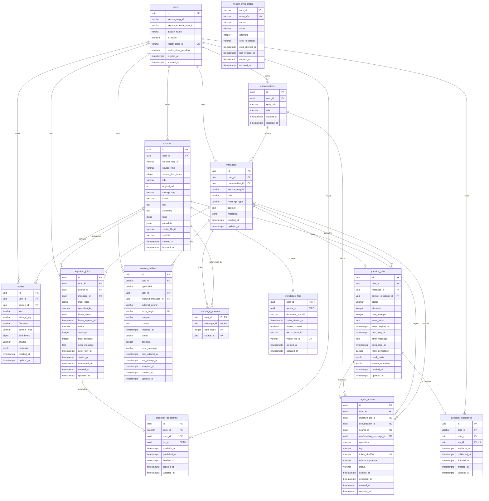

# 数据库 ER 模型（M1—M8）

PostgreSQL 16；SQLAlchemy 2；基础迁移 `0001_initial.py`，M7 head `0005_agent.py`，完整迁移往返、漂移检查和本地工程验证已通过。UUID 主键由应用生成；日期使用 `TIMESTAMPTZ`，应用统一 UTC。JSONB 的默认值由数据库和应用共同定义。



## 字段说明

| 表 | 核心含义与可空字段 |
| --- | --- |
| users | `(wecom_corp_id, wecom_external_user_id)` 唯一标识官方渠道身份；display_name、vector_store_id 可空；is_active 默认 true。是否允许接入仍必须检查 allowlist，不能只检查此布尔值 |
| sources | 用户资料主记录；原始 URL/对象键/消息 ID/正文/摘要/远端文件 ID/hash 可空，便于尚未下载与 metadata_only；title/source_type/status 必填；tags 默认 []、metadata 默认 {} |
| assets | 原件或派生文件，storage_key/kind/size_bytes 必填，filename/content_type/hash 可空；metadata 放时间轴、帧秒数等结构信息 |
| conversations | 属于用户和微信客服账号；title 可空；不假设单用户永远只有一个会话 |
| messages | 会话下用户/助手/系统消息；微信消息 ID 与正文可空，以支持事件/附件；metadata 存经过筛选的结构字段 |
| ingestion_jobs | 单来源可有多次任务；status 默认 queued；attempts=0、max_attempts=3；失败必须保存非空 error_message；重试/起止时间可空 |
| wecom_sync_states | 复合主键 (corp_id,open_kfid)，客服级协调表；cursor 初始 NULL、最长 64 字节（adapter 校验）；ready/retry/failed，错误保留、有限重试，行锁串行同步 |
| wecom_outbox | 按消息+purpose 幂等；ack 为首次确认，ingestion:job:outcome 为收录结果，agent:job:generation:part 为问答分段；固定 reply_msgid；queued/sent/deferred/failed/uncertain；sent 仅指 API 接受，accepted_at 不是送达证明 |
| message_sources | 同一消息多个来源；item_index 从 0 开始；内容重复时映射改指向既有 source，保留候选 source 的 deleted tombstone |
| ingestion_dispatches | user/job/corp 通过复合外键约束；一 job 一 dispatch；available_at 为下次可投递时间、published_at 为上次持久入 Redis 时间、finished_at 终结 |
| knowledge_files | M6 远端操作账本；复合主键 (user_id,source_id)，复合外键绑定 sources；document_sha256 对应实际上传 Markdown，upload_started 记录已发起上传；store/file ID 可空，file ID 全局唯一 |
| question_jobs | M7 每条入站问题一项；answer_message_id 可空，完成/终结失败后关联助手消息；attempts=0、max_attempts=3；reply_generation 从 0 开始，人工重试递增；result_parts 默认 []，source_snapshots 默认 {}，存来源 UUID 到内容/元数据快照签名的映射 |
| question_dispatches | 独立于 ingestion 的问答调度账本；一 job 一 dispatch；user/job/corp 由复合外键关联；available_at、published_at、finished_at 分别记录可投递、上次入 Redis、终结时间 |
| agent_actions | 每条问题至多一个待确认操作；operation 为 delete_source/add_tag；tag、confirmation_message_id、executed_at 可空；保存确认码 hash、来源快照签名和绝对 UTC expires_at，不在此表保存明文确认码 |

sources 满足需求列出的全部字段。SQLAlchemy 将数据库列 metadata 映射为 Python 属性 `metadata_`，避免与 ORM 自身 metadata 冲突；CanonicalDocument 仍使用标准字段名 `metadata`。

source_type：note / image / pdf / word / excel / ppt / audio / video / web_page / wechat_article / wechat_channel / other。

source.status：received / processing / stored / ready / metadata_only / failed / deleting / deleted。stored 是保存正文但尚未索引；ready 表示 M6 远端索引已 completed 且本地映射已提交。

job.status：queued / downloading / parsing / transcribing / indexing / completed / failed。M3 实现领取/阶段/租约恢复，M5 使用 transcribing，M6 索引和远端清理使用 indexing。lease_token 与 lease_expires_at 必须同时为空或非空；input_data 包含官方归一化输入或内部受控知识任务类型。

question_jobs.status：queued / processing / completed / failed，与 ingestion 状态机分开。失败必须有非 NULL、非空 error_message；租约字段必须成对。next_retry_at 有值的 failed 可等待自动重试，终结失败仍可保存固定失败提示及助手消息。completed 表示问答结果已原子落库，不等于微信已送达。

agent_actions.status：pending / executed / expired。expires_at 自提案创建起十分钟，确认时按绝对截止时间裁决；过期动作不要求有后台扫描及时修改 status，发送和确认检查都会检查期限。重复确认 executed 动作不会重复执行。token_sha256 只存 hash，但包含明文确认码的待发送消息及 outbox 仍属于敏感用户数据。

## 约束与索引

- 六张基础业务表分别以 UUID 为主键；其他表包含下述复合键。子表 user_id 外键指向 users，删除用户时级联数据库子记录；外部对象/向量文件清理必须先经 M6 删除服务，不直接依赖数据库级联。
- sources 和 conversations 都有 `(user_id,id)` 唯一约束。assets/ingestion_jobs 以 `(user_id,source_id)` 复合外键引用 sources；messages 以 `(user_id,conversation_id)` 引用 conversations。即使绕过 RLS 的管理员写入，错误跨用户关系仍被拒绝。
- messages 保留 `(user_id,wechat_msg_id)` 唯一约束；sources 在 M3 扩展为 `(user_id,wechat_msg_id,source_item_index)`，序号非负。NULL 消息 ID 允许内部来源，原来的消息幂等仍由 messages 负责。
- sources 的 `(user_id,sha256)` 部分唯一索引仅覆盖非 NULL 且 status 不是 deleted 的记录。同用户并发重复收录由数据库裁决；不同用户相同内容独立保存；删除后可重新收录。
- sha256 必须为 64 个小写十六进制字符或 NULL；asset.size_bytes 不得为负数；job attempts 不得为负、max_attempts 必须大于零；failed 必须有非空 error_message。
- 常用访问索引：sources(user_id,created_at)、assets(user_id,source_id)、conversations(user_id,created_at)、messages(user_id,conversation_id,created_at)、ingestion_jobs(user_id,status,next_retry_at)、sources.vector_file_id。
- users.vector_store_id 唯一，防止两个用户错误绑定同一个向量库；NULL 表示尚未创建。
- M6 users.vector_store_pending 默认为 false；在创建远端 store 前持久化，防止结果不确定时盲目重复创建。ingestion_jobs.operation_key 可空，`(user_id,operation_key)` 唯一；知识任务按 operation/source 幂等，旧解析任务保持 NULL。
- knowledge_files 的 document_sha256 必须为 64 个小写十六进制字符，vector_file_id 全局唯一防止不同用户复用远端身份。表启用 ENABLE/FORCE RLS，pkb_app 仅有租户内 SELECT/INSERT/UPDATE；pkb_connector 没有权限。
- question_jobs 的 `(user_id,id)` 和 `(user_id,message_id)` 唯一；分别以 `(user_id,message_id)`、`(user_id,answer_message_id)` 关联 messages，防止问题或回答跨用户。问答结果和 outbox 同事务提交；原始消息重放不产生第二个问答任务。
- question_dispatches 以 `(user_id,job_id)` 关联 question_jobs，以 `(user_id,corp_id)` 关联 users；job_id 唯一，`(corp_id,finished_at,available_at)` 为到期调度索引。Redis 只传 dispatch UUID，不能指定租户。
- agent_actions 的 `(user_id,question_job_id)` 唯一；问题、会话、来源、确认消息均使用包含 user_id 的复合外键；确认码 SHA-256 全局唯一且为 64 位小写十六进制。操作和状态有数据库 CHECK，具体来源版本、参数与会话有效期由事务中的业务校验裁决。
- 人工问答重试增加 reply_generation；outbox purpose 包含问答 ID、代次和分段序号。发送前重新检查该代次与 result_parts，并共享锁定 job 至官方 HTTP 结束，旧失败回复不能跨越新重试继续发送。

## 行级安全

六张基础表同时启用 ENABLE / FORCE ROW LEVEL SECURITY；后续业务表延续同一隔离规则，企业级协调表使用下述企业策略。users 按 `id` 匹配事务租户，其余租户表按 `user_id` 匹配，USING / WITH CHECK 均使用：

```sql
NULLIF(current_setting('app.user_id', true), '')::uuid
```

`tenant_session(factory, user_id)` 在事务内执行参数化 `set_config(..., true)`，提交/回滚后设置失效。未绑定租户时查询没有记录、写入被拒绝；不依赖每位开发者都记得加 WHERE 条件。事务内仍建议显式 user_id 筛选，作为易审查的第二道边界。

业务角色 `pkb_app` 无超级用户/BYPASSRLS/建库/建角色权限；六张基础业务表授予 SELECT/INSERT/UPDATE/DELETE，迁移版本表授予 SELECT；新增表权限分别列于对应阶段说明。管理员连接仅用于 migration/init/test。M1 readiness 检查迁移版本及特权/owner 身份，配置不符合要求时返回不就绪。RLS 防止遗漏筛选，不能替代可信身份认证，也不声称抵挡能任意执行 SQL 的攻击者；M2 完成身份认证后才绑定租户。

M2 的身份引导使用已验证的企业+external_userid 派生稳定 UUID，再以 pkb_app 租户事务创建用户、会话、消息及 outbox。Outbox 同时以 `(user_id,corp_id)` 关联 users、`(user_id,inbound_message_id)` 关联 messages，阻止跨企业/用户错配；M3 后 `(user_id,inbound_message_id,purpose)` 和 `(corp_id,open_kfid,reply_msgid)` 唯一。正文限制为 1—2048 UTF-8 字节，回复 ID 为 1—32 个合法 ASCII 字符；失败/延迟/不确定状态要求 error_message。

两个 M2 表启用 FORCE RLS。`pkb_connector` 仅有 sync SELECT/INSERT/UPDATE、outbox SELECT/UPDATE 和迁移表 SELECT；通过事务内 `app.wecom_corp_id` 按企业隔离，无身份时不可见。它没有六张业务表权限。`pkb_app` 在 outbox 只有 SELECT/INSERT，并仍按 user_id 隔离；无 sync 表权限。Outbox 保留审计关联，当前外键阻止直接删除有关用户/消息，后续删除服务必须显式清理 outbox 再清理核心记录。

M3 的 message_sources 和 ingestion_dispatches 启用 FORCE RLS；pkb_app 仅按租户 SELECT/INSERT/UPDATE。pkb_connector 仅能按企业 SELECT/UPDATE dispatch，不能创建 dispatch，也不能访问 message_sources。复合外键同时约束 user/message、user/source、user/job 以及 user/corp，禁止跨租户引用。outbox 的入站幂等键改为 `(user_id,inbound_message_id,purpose)`。

M7 的 question_jobs、question_dispatches 和 agent_actions 同时启用 ENABLE/FORCE RLS，pkb_app 仅按租户 SELECT/INSERT/UPDATE，没有 DELETE 权限。pkb_connector 只获 question_dispatches 的 SELECT/UPDATE，通过 `app.wecom_corp_id` 限定企业；无 question_jobs/agent_actions 权限。微信发送前的问答/来源检查另开受限租户事务，不扩大 connector 权限或使用迁移连接。身份与来源共享锁持续到模型/发送 HTTP 结束；确认执行、租约和人工重试使用相应行锁协调。

M3 降级要求没有 M3 dispatch/mapping、stored 来源、多来源序号或新增用途回复，否则明确拒绝，避免静默丢失业务数据。部署回退需备份恢复方案。

## 后续迁移方向

- M2 已实现：客服同步游标、持久消息/回复幂等、outbox 及发送结果；不创建 ingestion_jobs。
- M3 已实现：多来源映射、任务租约/计数/错误与恢复、事务 dispatch；完整历史尝试审计和丰富内容版本暂未实现。
- M6 新增 revision 0004_knowledge：knowledge_files、用户 store pending 与 job operation_key。存在 M6 账本或用户远端绑定时拒绝破坏性 downgrade。
- M7 新增 revision 0005_agent：question_jobs、question_dispatches、agent_actions 及其复合关系、RLS 和受限 grants；存在任何 question_jobs 或 agent_actions 数据时拒绝 downgrade，要求显式数据迁移/恢复方案。
- M8 复用 messages.metadata 中的 channel_supplement 意图、ingestion_jobs.operation_key 和 input_data、message_sources 与 ingestion_dispatches，不新增迁移或扩大 grants。卡片 source_id/sha256/storage_key 保留，后补视频以新 assets 和 metadata 中 supplement_sha256/supplement_original_key 记录。M9 的接入、预检与运维工具复用现有权限和数据结构，head 仍为 0005_agent。

初始迁移之后的 schema 变化都新增 Alembic revision；不能改已应用到正式环境的历史 revision。迁移测试使用独立 `_test` 数据库，验证 upgrade → check → downgrade → upgrade → check。
